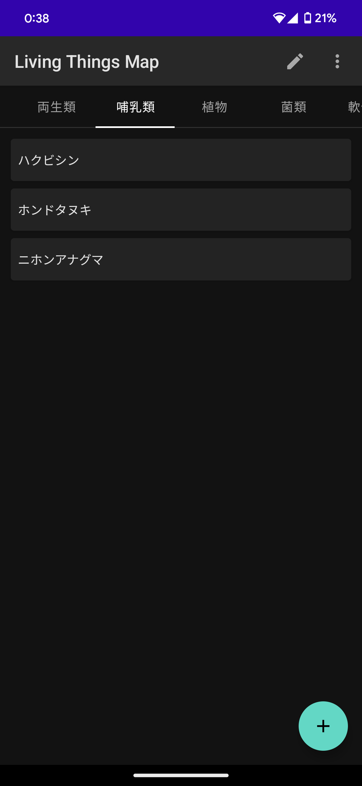
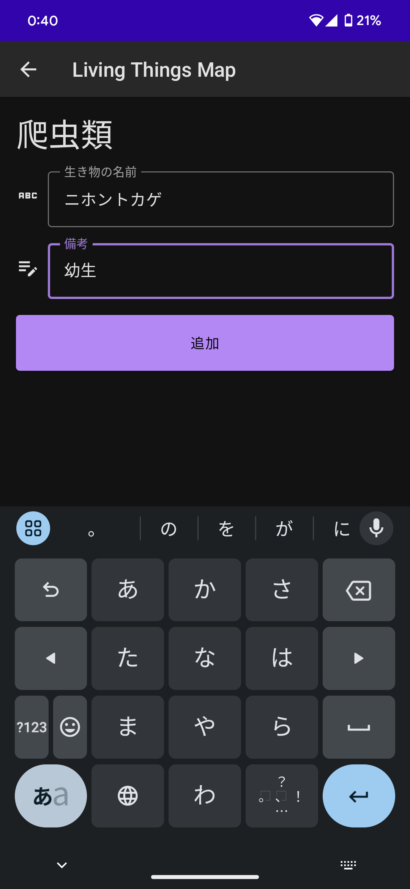
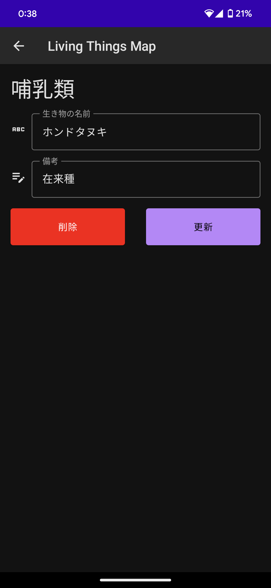
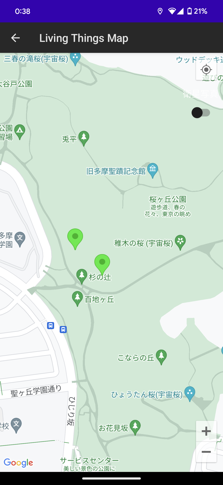
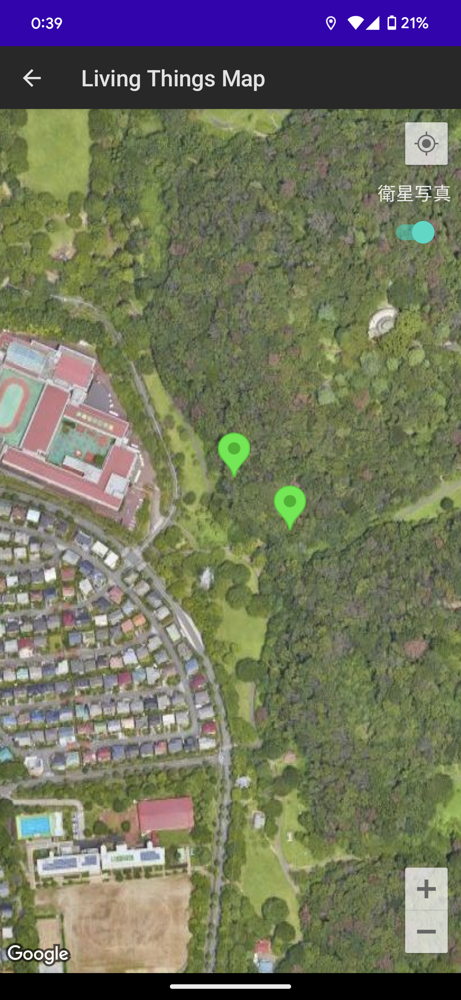

# LivingThingsMap概要
見つけた生き物を地図に記録するシンプルなアプリです。
位置情報を含む生き物情報を内部DBに記録し、地図に表示する簡易なものです。

手探りでしたが、Jetpack Composeで作成し、2022年夏頃にPlayStoreにてリリースまで行いました。

APIレベルの追従をしていなかったため、2023年8月にはストアからダウンロードできなくなってしまいました。
（現在は、メンテナンスが行われていないとの理由で、デベロッパーアカウント自体削除されてしまいました。。。）

# アプリ画面
- 一覧画面 

-  生き物追加画面 

-  生き者編集画面 

-  地図画面 

